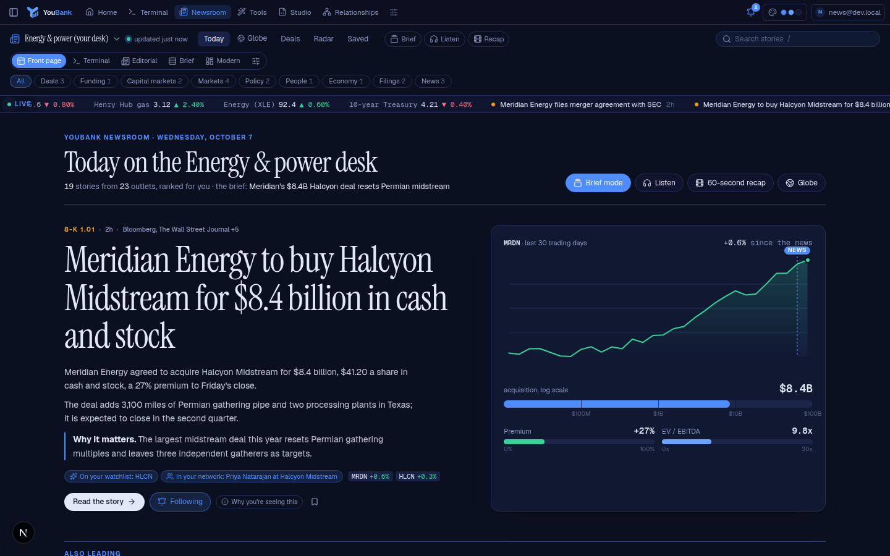
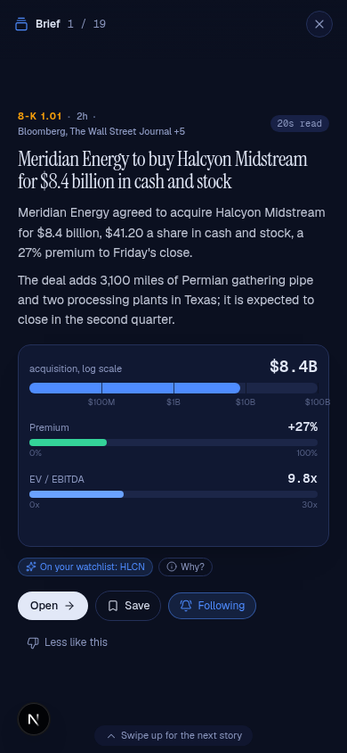
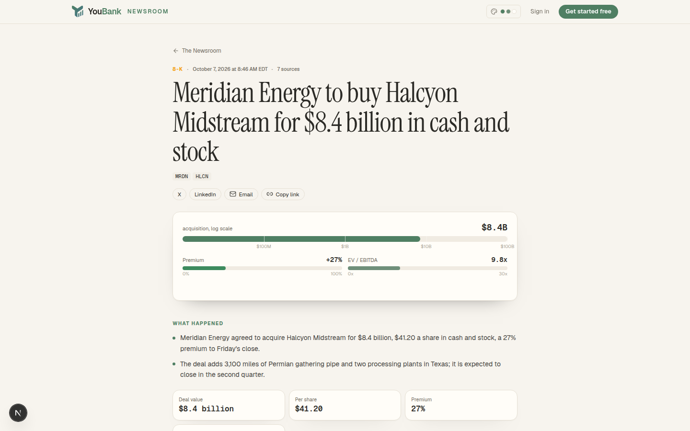
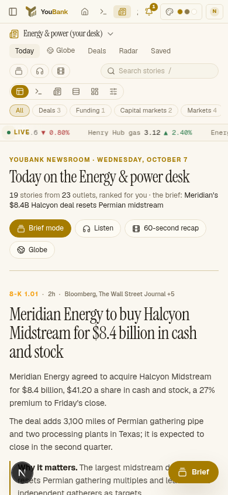
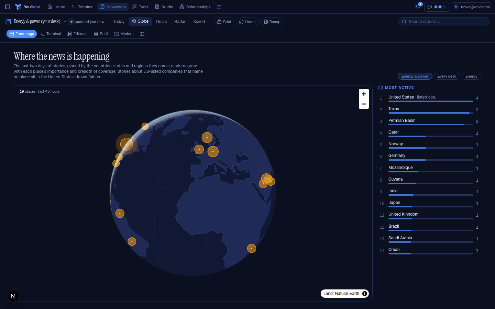
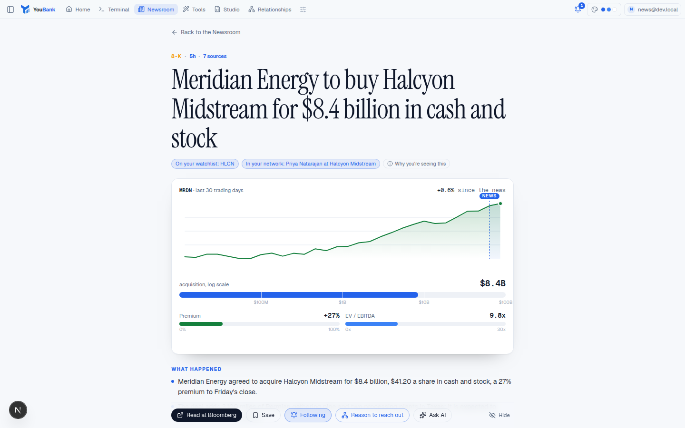

# The Newsroom

A news desk for every profile, built on free sources, ranked for each person (and learning from what
they read), readable five ways, listenable, swipeable, and shareable as public pages.
Code: `src/lib/news/` (pipeline), `src/components/news/` (interface), `src/app/api/news/*`,
`/api/cron/news` and the public pages in `src/app/news/`. Tests: `scripts/test-news.ts`. Data:
migrations `drizzle/0011_newsroom.sql` and `drizzle/0021_newsroom_plus.sql`.

## Sources, and the line we hold

| Kind | Sources | What we use |
|---|---|---|
| Publisher feeds (≈80) | Bloomberg, WSJ, FT, NYT DealBook, CNBC, MarketWatch, Axios, Semafor, The Information, TechCrunch, Crunchbase News, STAT, Endpoints, the Industry Dive titles, PE Hub, trade press | Headline, link, the publisher's own summary |
| Press-release wires | PR Newswire (M&A, financial services, energy, health, tech), GlobeNewswire (M&A), Business Wire | Headline, summary, link (releases are published to be redistributed) |
| Regulators and statistics | Federal Register (rules from FERC, DOE, EPA, FDA, CMS, SEC, the Fed, FDIC, OCC, CFPB, FCC, IRS, FTC), Fed, SEC, FDA, EIA, CFPB, BLS, BEA | Public-domain text |
| SEC filings | EDGAR's latest-filings feed by form | Public records, with the link to EDGAR |
| Tech radar | Hugging Face papers and models, GitHub search, Show HN (Algolia) | Public APIs |
| Sector radars | Federal Register (FERC, DOE, NRC, Federal Reserve, ITC, BIS, USTR, EPA, DOT, OSHA, FTC, CPSC, FCC, HUD, FHFA), ClinicalTrials.gov, openFDA, PubMed, FDIC, CPSC recalls, EIA, DOE OSTI, the Fed's papers, NBER, arXiv | Public records and abstracts, linked |
| Reuters and AP | GDELT, best effort (it throttles shared addresses), and research briefs | Headline and link |

Every feed was checked live on 2026-09-28; dead, blocked and stale ones were dropped (Nasdaq's RSS
timed out; VentureBeat, PitchBook, FERC and Fierce Biotech refused; StrictlyVC last posted in 2020).

**The line:** articles are never copied into the app. Readers see the headline, our own summary and a
link to the publisher. The pipeline may read an open article (not paywalled, allowed by the site's
robots.txt, not marked `isAccessibleForFree: false`) to write a better summary; that text lives only in
memory for the model call and is never stored or shown. Paywalled publishers are never fetched. The
fetcher identifies itself (`YouBankNews/1.0` with a contact URL) and uses conditional requests, so an
unchanged feed costs the publisher a 304.

## Filing signals

EDGAR's latest-filings Atom feed carries each 8-K's item numbers, so a merger agreement (1.01), a
bankruptcy (1.03), a debt acceleration (2.04), an auditor change (4.01), a restatement (4.02) or a change
of control (5.01) becomes a story within minutes of filing, often before any outlet writes it up.
Routine items (7.01, 8.01, 9.01) are dropped. By form: S-1 and F-1 (IPO filings), 424B4 (pricings),
13D (stakes, with the filer named), SC TO-T (tender offers), SC 13E3 (going private), DEFM14A and
PREM14A (merger proxies), S-4, NT 10-K and NT 10-Q (late filings), and Form D (raises of $3M and up, and
fund closes of $25M and up, from each filing's primary document; securitization vehicles skipped). A
filer's sector comes from its SIC code, remembered for 30 days. SEC's forms are polled one at a time in
their own lane so the ten-requests-a-second limit is respected.

## The pipeline (every ten minutes)

1. **Ingest.** Sources whose time has come (each has its own interval, 10 minutes for the wires and
   8-Ks, hours for regulators; failures back off exponentially). Items are cleaned (canonical URL,
   entities, publisher suffixes), tickers read from "(NYSE: XOM)" and cashtags, and first-pass
   categories and desk tags read from their words.
2. **Cluster.** One story per event. Headline embeddings (OpenAI `text-embedding-3-small` at 256
   dimensions, int8, about 350 bytes each; a few cents a month) plus word and figure overlap.
   Calibrated on live headlines: unrelated pairs sit below 0.6 cosine 99.9% of the time; the same event
   from different outlets, or from both sides of a deal ("Gates completes acquisition of the belts
   business" and "Timken completes sale of belts business to Gates", 0.91), scores 0.74 to 0.91. So an
   item joins a story at cosine 0.82, or at 0.72 with a second signal (a shared ticker, a shared figure
   such as "$27bn" = "$27 billion", or some shared words). Filings join only on the same ticker and a
   deal-like event. Models, repositories and papers never merge on similarity.
3. **Read.** A small model (GPT-5.6 Luna, low effort) reads each important story once, from its
   sources only: bullets, key numbers, why it matters, companies (tickers checked against SEC's list),
   deal terms. The schema is lenient and the output is tidied afterwards, because in non-strict mode the
   API does not enforce sizes and one extra bullet must not discard a reading. A failed reading is
   retried after half an hour, three times at most.
4. **Merge.** Stories that turn out to be one event fold into the earliest: the same deal (fuzzy names:
   "AMD" and "Advanced Micro Devices" do not match, but "World Labs" and "Fei-Fei Li's World Labs" do),
   or close meaning with a shared company or figure.
5. **Deals.** Each deal, raise, IPO, financing and bankruptcy becomes a row. For US-listed targets:
   the premium to the last close before the news, and implied EV/EBITDA and EV/revenue from the offer
   and the target's SEC figures. League tables count named advisors.
6. **Alerts, briefs, research, retention.** See below. Items are kept 30 days, embeddings 4 days,
   stories 120 days unless saved or a deal.

## Radars

Every sector has a radar of what comes before the news, chosen per person (the default is their desk's
sector; Technology is the tech radar). Lanes by sector:

| Sector | Lanes |
|---|---|
| Energy | Pipelines and projects (FERC, DOE and NRC notices read as milestones: application, environmental review, impact statement, approval; LNG exports; nuclear licensing), research and analysis (EIA, DOE OSTI) |
| Healthcare | New industry Phase 2 and 3 trials (last three weeks, with enrollment and countries), FDA approvals (original NDAs and BLAs, NMEs and priority reviews marked), trial results in major journals |
| Financials | Bank deals filed with the Fed (each application in the Federal Register notice: applicant, target, states, Reserve Bank, comment deadline), FDIC failures, research (Fed papers and notes, NBER, arXiv) |
| Industrials | Trade cases and export controls (ITC cases with the exporting countries, Entity List, USTR), EPA, DOT and OSHA rules, robotics research |
| Consumer | CPSC recalls (units, where sold, where made), trade and tariffs, FTC and CPSC rules |
| Media and telecom | FCC rules, networking research |
| Real estate | HUD and FHFA rules, housing and property research |

Routine filings are left out (airworthiness directives, state air plans, FM allotments, pesticide
tolerances, information collections). Each radar also shows the sector's deals of the last 30 days and
a map: bubbles count the places the lanes name (trial countries, the states in a bank application,
exporters) and the places named in the week's stories for the sector, read with a gazetteer that
handles ambiguity ("Georgia" is the state in text and the country in trial records; "British thermal
units" is not Britain); arcs are movements the sources state (exporters to the US, one state's bank
buying another's, where a recalled product was made). Coastlines and state lines are Natural Earth and
US Census shapes (public domain, via world-atlas and us-atlas), tinted with the theme's tokens.

Radars are built from their sources, cached for two days and rebuilt when older than three hours by
the Newsroom pass (two per pass); a source that does not answer keeps its last good lane. arXiv is read
by category listing only (it rate-limits abstract searches), one request every three seconds.

## Ranking

A story's score for a person is desk fit (lenses count most, then sectors), importance (source
standing, breadth of coverage, event type, size, filing weight, then the model's view), personal reasons
(watchlist and followed tickers, companies where their Relationships contacts work, followed topics),
what their own reading has taught the page, and freshness (a 20-hour half-life). Muted sources and
topics drop out. Every reason is shown on the card in words, and "Why you're seeing this" lays out
every part of the sum as bars.

### The learned front page (`affinity.ts`)

A simple, explainable model, deliberately not a black box:

- What a person reads (opening a story, or four seconds on a Brief card), saves, follows and hides
  are votes for every feature of that story: its desk tags, tickers, named companies and kind.
  Read 1, save 3, follow 4, hide -4.
- Votes fade with a 14-day half-life; nothing older than 60 days is read. A feature's affinity is
  tanh(votes / 4), between -1 and 1.
- A story's learned score takes its best company or ticker in full, desk tags at 0.6 and its kind at
  0.4, the second-best feature at half, and the strongest dislike in full; it adds at most 0.35 to the
  score (about what a followed topic adds) and a disliked story sinks but is never hidden.
- The reason names the evidence: "You read 6 Energy & power stories lately", "You saved 2 stories on
  NVDA", "Fewer like this: you hid 2 stories on Acme".
- A greedy re-rank keeps the top 40 varied: the same lead company again loses 25%, a category's third
  story and beyond 10% each, a sector's fourth and beyond 5% each.

The signals are the person's own rows in `news_user_items` and `news_follows`, read once per two
minutes per instance; no new table.

### Why this matters to you (`matters.ts`)

Free and rule-based: the story matched against the person's watchlist and followed tickers, the
companies where their Relationships contacts work, their open Relationships pipeline items, and their
(and their team's) Edge watches, by company, ticker, or a watched area containing a place the story
names. Each match links to where it lives. The AI note that builds on these matches is premium
(`news.why-ai`) and written on request; a note already written is free to read again.

## Desks

A desk is lenses (M&A, ECM, DCM, leveraged finance, restructuring, sponsors, PE, private credit,
infrastructure, venture, the radar, markets, event-driven, credit, corporate finance, strategy,
accounting, careers, the economy, policy) and sectors. Each banking group, PE strategy, markets seat and
role maps to one, with its own market watch (crude, Brent and gas for energy; XBI for healthcare; KRE
for FIG; HYG and leveraged loans for credit desks) and calendar (EIA's weekly reports and the rig count
for energy; jobless claims for markets desks; watchlist earnings dates).

## Premium (`src/lib/billing/features/news.ts`)

| Feature | Plan | Metered | Cost per use | Checked in |
|---|---|---|---|---|
| `news.audio`: AI audio briefing | Pro | yes | $0.065 | `POST /api/news/briefing` |
| `news.audio-daily`: daily audio briefing | Pro | yes | $0.065 a day | `POST /api/news/prefs` (switching on) and the Newsroom pass (each run) |
| `news.why-ai`: AI "why it matters to you" | Pro | yes | $0.001 | `POST /api/news/story/[id]` (`why`) |
| `news.follows`: unlimited story follows | Pro | no | | `POST /api/news/story/[id]` (`follow`, past five) |

Everything else (the front page, globe, charts, timelines, maps, Brief mode, the recap, the browser
briefing, rule-based matches, five follows, public pages) is free. Administrators can use all of it.

## AI and its budget

| Work | Tier | Pauses at |
|---|---|---|
| Story readings, deal terms | essential | 100% of the cap |
| The morning brief (one per desk per day) | brief | 92% |
| "Why it matters to you" (on request) | personal | 80% |
| Research briefs (08:00 and 13:00 New York, weekdays) | research | 70% |

The cap (`NEWS_AI_BUDGET_USD`, $25) is read from the usage ledger (features named `news-…`). Past it,
headlines, sources, filings, clustering (word overlap) and ranking still work.

## Delivery

In the app always: the bell, Home's "Today's brief", the Newsroom. By choice, all free: email from the
person's own connected mailbox to themselves (Gmail or IMAP/SMTP, multipart HTML), browser push (Web
Push with VAPID keys; expired devices are removed), and Slack (an incoming webhook, encrypted at rest).
Alerts go by email only when urgent; quiet hours hold the rest. A story alerts once per person, at most
five per run. Network alerts also raise a "reconnect" suggestion in Relationships, whose draft uses the
story as its reason.

## Following a story

Follow any story (five free, more with `news.follows`). Each Newsroom pass compares the story's
outlets and last update with what the person last heard; another outlet joining, or new reporting
three hours on, becomes one "Story update" in the bell and a push to their devices (held in quiet
hours), at most once per story every two hours and five a pass. Follows move with merged stories and
lapse after 30 quiet days.

## Audio briefing

Listen opens a player with a chapter per story (an opening, the person's "for you" stories, then the
desk brief, the market watch, a close), with skip, speed and lock-screen controls.

| Version | Script | Voice | Cost |
|---|---|---|---|
| Free | Built from the stories' own summaries, made speakable ("$4.1bn" is "4.1 billion dollars") | The browser's own (Web Speech API) | Nothing |
| `news.audio` (Pro), on a click | A small model rewrites the chapters as spoken English from their facts only | OpenAI `gpt-4o-mini-tts`, one request per chapter, the person's chosen voice and speed | About $0.065 |
| `news.audio-daily` (Pro), switched on | The same, made at the brief time each morning and announced in the bell | The same | About $0.065 a day |

The plan is checked when the daily switch is turned on and again before every morning's run. Audio
goes to R2 (signed links, an hour each) when it is set up; otherwise it is returned once with the
response and not kept. Without `OPENAI_API_KEY` the AI script is still written and the browser reads
it; without a model or a voice nothing is stored or spent. Spend goes to the person's own AI ledger
(`audio-briefing-script`, `audio-briefing-voice`), under their daily AI cap, not the shared Newsroom
budget. Briefings are kept a week.

## Brief mode and the 60-second recap

Brief mode is the day as a vertical deck, one card per screen: scroll-snapped on a phone (swipe up),
keys on a desktop (↓/j, ↑/k, s save, f follow, x less like this, Enter, Esc). Each card is a 20-second
read (the headline and as much summary as fits in about 60 words) with one chart: the deal, the price
reaction, the key figures, or how fast coverage spread.

The recap is the day in about a minute of animated slides (a title card, five stories, the deals
board, the movers, a close), drawn on a 1080 by 1350 canvas in the person's theme. "Save images" hands
every slide to the share sheet (or downloads them); "Record video" plays it once while the browser's
MediaRecorder captures the canvas to WebM (MP4 where that is all the browser records). Nothing is
encoded on our side.

## The globe

Where the last 48 hours of stories are happening: MapLibre's globe projection with a style of our own
(land from `public/news/land.json`, generated from the radar's Natural Earth outline by
`scripts/gen-news-land.ts`; no map tiles), tinted from the theme and re-tinted when it changes.
Stories are placed by the places they name (the radar's gazetteer); a story about a US-listed company
or a filing that names no place sits in the United States, drawn fainter. Markers are sized by the sum
of their stories' significance (importance raised by breadth of coverage), coloured by sector, the
busiest pulsing; the desk filter runs in the browser. It turns slowly until touched (rich motion
only). It is a view of its own and a teaser on the front page, loaded only when it scrolls into view.

## Inside a story

The reader adds, to the summary and sources: the story's best chart (the price reaction with the
moment it broke marked and a crosshair, the deal on a log scale with its premium and multiple, the key
figures as bars, or coverage over time), drawn in as it scrolls into view; a timeline (earlier stories
on the same companies, the first report, each outlet as it joined, filings by form); a relationship
map (buyer and target joined by the deal, advisors beside the side they advise, people beside their
company, and your own contacts, in the app only); "why this matters to you"; Follow; and Share.

## Public pages

`/news` and `/news/<id>-<headline-words>` are open to anyone, built only from `public.ts`, which takes
no user at all: headline, our summary and figures, chart, timeline, the public relationship map, and
every source linked. Never reasons, notes, saved or followed state, watchlists, contacts or pipeline.
Each page has a canonical URL (old slugs redirect), Open Graph and Twitter metadata, NewsArticle
JSON-LD, a generated link preview (`opengraph-image.tsx`: the headline beside a chart from the story's
data), share buttons, and an invitation to sign up (signing in returns to the story). The last week's
notable stories are in the sitemap, and `/news` is open to crawlers.

## Editions

One set of components; the look is CSS variables on `.nr[data-look]` (type, scale, density, surfaces,
radius, shadow), the layout a component:

| Edition | Look | Layout | Default for |
|---|---|---|---|
| Front page | Display serif over data art, soft cards | Front: a ticker of markets and headlines, the hero beside its chart, data-art cards, "the day in data" (deal sizes, how the names moved, what the news is about, the day's filings), "for you", the globe, sections | VC, consulting, students |
| Terminal | Bloomberg: mono, dense, ruled rows | Wire, grouped by hour, with a ticker tape | Public markets |
| Editorial | FT, The Information: serif display, hairlines, air | Magazine: masthead, lead with parallax, sections | |
| Brief | Axios, Morning Brew: heavy sans, "why it matters" | Hybrid: the brief, the live wire, story rails | Banking, corporate finance, accounting |
| Modern | Apple News, Linear: soft depth, round | Dashboard: brief, market watch, calendar, tiles, deals, filings, league table, radar | PE |

Visuals are data art, never licensed photos: the company's 30-day price line, a deal-size bar, a filing
stamp, a paper's upvotes, or a monogram on its sector's colour. Cards without a chart get a generated
thumbnail, the same every visit: the price line as a ridge, rings for a deal's size against $1B, a
stamped form over ruled lines, or one arc per outlet fanned around the company's initials. Motion is rich (layouts cross-fade,
cards spring and flip to show why a story matters, numbers tick, the tape scrolls), subtle, or off, and
always off when the system asks for reduced motion.

## Screenshots

| | |
|---|---|
|  |  |
|  |  |
|  |  |

Taken from fictional stories in a local harness (no real companies or figures).
